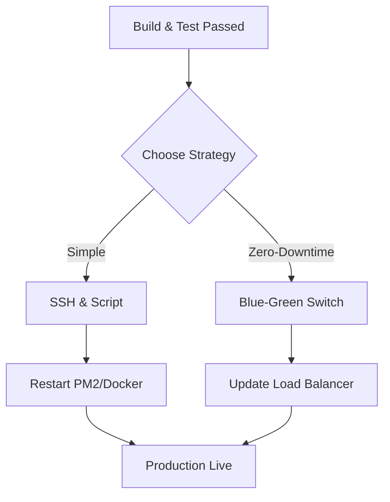

Deployment is the final stage of the CI/CD pipeline. In this lesson, we explore how to ship code reliably and how to handle updates without interrupting your users.

## 1. Manual vs. Automated Deployment

*   **Manual:** You SSH into the server, run `git pull`, and restart PM2. This is slow and prone to human error.
*   **Automated:** Your GitHub Action uses a "Deploy Key" to securely connect to your server and run the update script for you.

## 2. Common Deployment Patterns

Depending on your project size, you might choose one of these "Master" strategies:

### A. Recreate (The Basic Way)

The old version is stopped, and the new version is started.
*   **Downside:** There is a few seconds/minutes of downtime.
*   **Best for:** Dev environments or low-traffic internal tools.

### B. Rolling Deployment

You update servers one by one. If you have 3 servers, you update Server 1, then Server 2, then Server 3.
*   **Benefit:** The site stays online because at least two servers are always running.
*   **Best for:** Scaled applications using Load Balancers.

### C. Blue-Green Deployment

You have two identical environments: **Blue** (Live) and **Green** (New Version).
1. You deploy the code to Green and test it.
2. You switch the "Traffic Switch" (Load Balancer) from Blue to Green.
3. If anything goes wrong, you just switch back to Blue instantly.

## 3. Visualizing the Deployment Flow



## 4. Deploying via GitHub Actions (SSH)

The most common way for absolute beginners to automate a VPS (like DigitalOcean) is using an SSH action.

```yaml title=".github/workflows/deploy.yml"
- name: Deploy to Server
  uses: appleboy/ssh-action@master
  with:
    host: ${{ secrets.SERVER_IP }}
    username: ${{ secrets.SERVER_USER }}
    key: ${{ secrets.SSH_PRIVATE_KEY }}
    script: |
      cd /home/ajay/codeharbor-api
      git pull origin main
      npm install --omit=dev
      pm2 restart ecosystem.config.js

```

## 5. Database Migrations during Deployment

Deploying code is easy; deploying **data changes** is hard.

* **The Master Rule:** Never delete columns in a deployment. Always add new columns first, then migrate data, then delete old columns in a *future* deployment.
* **Automation:** Your script should run `npx knex migrate:latest` or `npx prisma migrate deploy` *before* restarting the application.

## 6. Post-Deployment Smoke Tests

A "Master" doesn't just assume the deployment worked. You should add a final step to your pipeline:

1. Wait 10 seconds for the app to start.
2. Run a `curl` command to your health-check endpoint (`/api/health`).
3. If it returns `200 OK`, the deployment is a success. If it fails, automatically roll back to the previous version.

## Practice: The "No-Touch" Deploy

1. Set up an SSH key on your server and add the private key to GitHub Secrets.
2. Create a `deploy.yml` that triggers only when you push to the `main` branch.
3. Push a small change (like changing a "Hello" message).
4. Wait for the Action to finish and refresh your website. You should see the update without ever opening your terminal!

:::info Rollbacks
Always keep the previous version of your code or Docker image tagged. If your smoke test fails, your script should automatically run the `pm2 restart` command for the previous working version.
:::