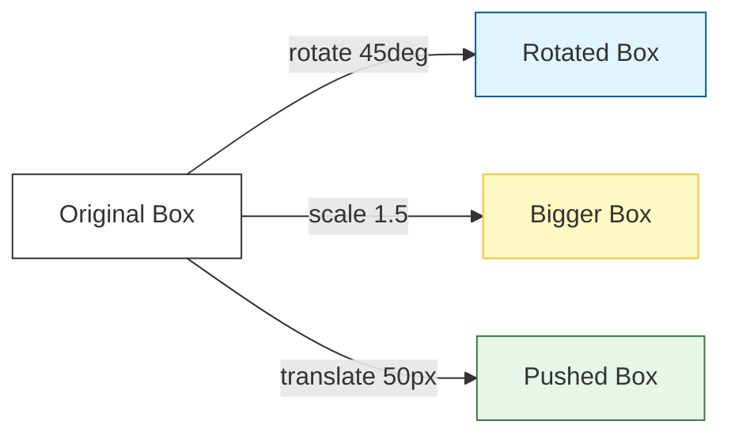

A static website is fine, but an **animated** website feels alive. In CSS, we have two main ways to create movement: **Transitions** (simple) and **Animations** (complex).

## 1. CSS Transitions

A transition allows you to change a property (like color or size) **smoothly** over a set duration, rather than having it snap instantly.

### The 4 Parts of a Transition:
1.  **Property:** What are you changing? (e.g., `background-color`).
2.  **Duration:** How long does it take? (e.g., `0.3s`).
3.  **Timing Function:** The "vibe" of the move (e.g., `ease-in-out`).
4.  **Delay:** How long to wait before starting? (e.g., `1s`).

```css
.button {
    background-color: blue;
    transition: background-color 0.3s ease;
}

.button:hover {
    background-color: red; /* This will now fade smoothly! */
}
```

## 2. Keyframe Animations

If Transitions are for "Point A to Point B," **Keyframes** are for complex, multi-step movements that can run automatically.

### Step 1: Define the Animation
We use the `@keyframes` rule to create a "script" for the movement.

```css
@keyframes slideIn {
    from {
        transform: translateX(-100px);
        opacity: 0;
    }
    to {
        transform: translateX(0);
        opacity: 1;
    }
}
```

### Step 2: Apply it to an Element

```css
.card {
    animation: slideIn 1s ease-out forwards;
}
```

## 3. Animation Properties

| Property | Description |
| :--- | :--- |
| `animation-name` | The name of your `@keyframes`. |
| `animation-duration` | How long one cycle takes (e.g., `2s`). |
| `animation-iteration-count` | How many times to repeat (`3` or `infinite`). |
| `animation-direction` | `normal`, `reverse`, or `alternate` (back and forth). |

## 4. The Power of `transform`

When animating, we avoid moving items with `margin` or `top/left` because it's slow for the browser. Instead, we use **Transforms**.

<Tabs>
  <TabItem value="move" label="Move & Scale" default>
      * `translate(x, y)`: Moves the item without affecting others.
      * `scale(2)`: Makes the item twice as big.
  </TabItem>
  <TabItem value="rotate" label="Rotate">
      * `rotate(45deg)`: Turns the item clockwise.
      * `skew()`: Tilts the item.
  </TabItem>
</Tabs>



## Interactive Practice: The "Pulse" Effect

Let's create a notification dot that pulses forever:

```html
<div class="pulse-dot"></div>
```

```css
.pulse-dot {
    width: 20px;
    height: 20px;
    background-color: red;
    border-radius: 50%;
    animation: pulse 1.5s infinite;
}

@keyframes pulse {
    0% { transform: scale(1); opacity: 1; }
    50% { transform: scale(1.5); opacity: 0.5; }
    100% { transform: scale(1); opacity: 1; }
}
```

:::warning Use Animations Sparingly
A website with too many moving parts is distracting and can cause "motion sickness" for some users. Use animations to **guide** the user, not to annoy them.
:::

:::info Performance
Always try to animate `transform` and `opacity`. These are "hardware accelerated," meaning the computer's graphics card handles them, keeping your website running at a silky-smooth 60 frames per second.
:::