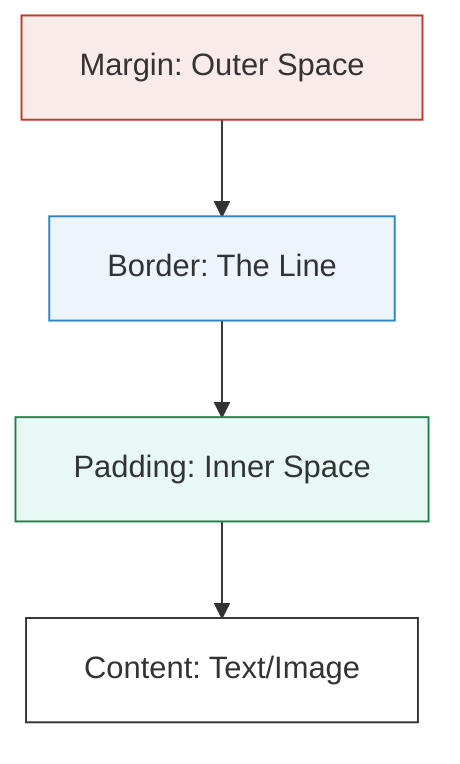

In CSS, **everything is a box**. Whether it's a circular button, a line of text, or an image, the browser sees it as a rectangular container. 

The Box Model determines exactly how much space an element takes up on your screen.

## 1. The Four Layers of a Box

Think of an HTML element like a framed photo you are sending through the mail:

1.  **Content:** The actual "photo" (The text or image).
2.  **Padding:** The "bubble wrap" inside the frame. It creates space **between the photo and the frame**.
3.  **Border:** The "wooden frame" itself. It wraps around the padding and content.
4.  **Margin:** The "safe space" outside the frame. It keeps **other boxes** from touching yours.

## 2. Visualizing the Layers

Here is how these layers translate into CSS code:



### The Breakdown:

  * **`width` & `height`**: Sets the size of the **Content** only.
  * **`padding`**: Clears an area around the content. It inherits the background color of the box.
  * **`border`**: A line that goes around the padding. You can set its thickness, style, and color.
  * **`margin`**: Clears an area outside the border. Margins are always transparent.

## 3. How to Write Box Model CSS

You can set these values for all sides at once, or for specific sides.

<Tabs>
<TabItem value="shorthand" label="⌨️ Shorthand" default>
You can set all four sides in one line. The order is always **Clockwise**: Top, Right, Bottom, Left.
`margin: 10px 20px 10px 20px;`
<em>(Top: 10px, Right: 20px, Bottom: 10px, Left: 20px)</em>
</TabItem>
<TabItem value="specific" label="📍 Specific Sides">
Use these for more control:

`padding-top` / `margin-top`
`padding-right` / `margin-right`
`padding-bottom` / `margin-bottom`
`padding-left` / `margin-left`

</TabItem>
</Tabs>

## 4. The "Box-Sizing" Problem

By default, if you give a box a width of `200px` and then add `20px` of padding, the box actually becomes **240px** wide ($200 + 20 \text{ left} + 20 \text{ right}$). This often breaks layouts!

### The Fix: `border-box`

Professional developers use `box-sizing: border-box;`. This tells the browser: "Keep the width at 200px, and put the padding **inside** that space."

```css
/* Apply this to everything! */
* {
    box-sizing: border-box;
}
```

## Practice: Create a "Featured Card"

Try building this in your `style.css`:

```css title="style.css"
.card {
    width: 300px;
    background-color: white;
    
    /* 1. The Border */
    border: 2px solid #333;
    
    /* 2. The Bubble Wrap (Inside) */
    padding: 20px;
    
    /* 3. The Safe Space (Outside) */
    margin: 50px auto; /* Centering the card */
    
    box-shadow: 5px 5px 15px rgba(0,0,0,0.1);
}
```

:::info Margin "Auto"
Setting `margin: auto;` on a box with a fixed width is the most common way to center an element horizontally on the page!
:::