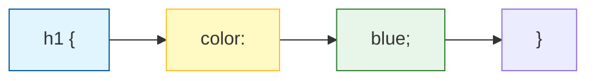

If HTML is the **skeleton** of a house, **CSS (Cascading Style Sheets)** is the paint on the walls, the style of the furniture, and the layout of the rooms. 

Without CSS, every website would look like a boring plain-text document. With CSS, we can make websites look professional, modern, and beautiful.

## 1. How CSS Works

CSS works by "selecting" an HTML element and telling it how to look. 

Think of it like giving a command: *"Hey Browser, find every **Paragraph**, and make the **Text Color Blue**."*



### The 3 Parts of a CSS Rule:

1.  **Selector:** Which HTML tag are we talking to? (e.g., `h1`, `p`, `button`).
2.  **Property:** What do we want to change? (e.g., `color`, `font-size`, `background`).
3.  **Value:** What is the new setting? (e.g., `red`, `20px`, `blue`).

## 2. Three Ways to Add CSS

There are three ways to link your styles to your HTML. As you grow as a developer, you will almost always use the **External** way.

<Tabs>
<TabItem value="external" label="🌍 External (Best Way)" default>
You create a separate file named `style.css`. This keeps your code clean and organized.
<br />

**In your HTML:**

```html
<link rel="stylesheet" href="style.css" />
```

</TabItem>
<TabItem value="internal" label="🏠 Internal">

You put your CSS inside `<style>` tags in the `<head>` of your HTML file.
<br />

**In your HTML:**

```html
<style>
h1 { 
    color: red; 
}
</style>
```

</TabItem>
<TabItem value="inline" label="📍 Inline">
You write the style directly inside the HTML tag.
<br />

**In your HTML:**

`<h1 style="color: blue;">Hello</h1>`

<em>(Avoid this! It makes your code messy.)</em>

</TabItem>
</Tabs>

## 3. The "Cascading" Secret

Why is it called **Cascading** Style Sheets? Because CSS follows a hierarchy (like a waterfall).

If you tell a paragraph to be **Red** at the top of your file, but then tell it to be **Blue** at the bottom, the browser will choose **Blue**. The last rule usually wins\!

## 4. Your First Styles

Here are the most common "paints" you will use first:

| Property | What it does | Example |
| :--- | :--- | :--- |
| `color` | Changes text color | `color: green;` |
| `background-color` | Changes the box color | `background-color: black;` |
| `font-size` | Makes text bigger/smaller | `font-size: 16px;` |
| `text-align` | Moves text (left/center/right) | `text-align: center;` |

## Let's Try It!

1.  Open your `index.html` from the HTML track.
2.  In the `<head>`, add this line:
    `<link rel="stylesheet" href="style.css">`
3.  Create a new file in the same folder called `style.css`.
4.  Type this in your CSS file:

```css title="style.css"
body {
    background-color: #f4f4f4;
    font-family: sans-serif;
}

h1 {
    color: darkblue;
    text-align: center;
}
```

5.  Refresh your browser and see the transformation!

:::tip Why learn CSS?
A website with great content but poor design is rarely trusted. CSS allows you to build **trust** with your users by making your work look professional and easy to read.
:::