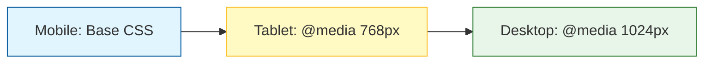

In the early days of the web, people only browsed the internet on bulky desktop monitors. Today, more than half of all web traffic comes from mobile devices. 

**Responsive Design** is the practice of building websites that "respond" to the size of the user's screen.

## 1. The Viewport Meta Tag

Before we write any CSS, we have to tell the browser how to handle the screen width. This tag belongs in the `<head>` of your HTML. Without it, your mobile site will look like a tiny, zoomed-out version of your desktop site.

```html
<meta name="viewport" content="width=device-width, initial-scale=1.0">
```

## 2. Media Queries: The "If" Statement of CSS

A **Media Query** tells the browser: *"If the screen is smaller than 600px, apply these special styles."*

```css
/* Standard Desktop Styles */
body {
    background-color: white;
    font-size: 18px;
}

/* Tablet and Mobile Styles */
@media (max-width: 768px) {
    body {
        background-color: lightgrey;
        font-size: 16px;
    }
}
```

## 3. Mobile-First Approach

At **CodeHarborHub**, we recommend the **Mobile-First** strategy. This means you write your styles for the smallest screen first, then use media queries to add complexity for larger screens.



## 4. Responsive Images & Units

To make things truly flexible, we avoid fixed pixels (`px`) for widths whenever possible.

<Tabs>
  <TabItem value="units" label="Flexible Units" default>
      * **% (Percentage):** Relative to the parent container.
      * **vw/vh:** Relative to the "Viewport" (screen) width/height.
      * **em/rem:** Relative to the font size (great for spacing).
  </TabItem>
  <TabItem value="images" label="Images">
    To keep images from "overflowing" off the screen, always add this to your CSS:

    ```css
    img { max-width: 100%; height: auto; }
    ```

  </TabItem>
</Tabs>

## 5. Flexbox + Media Queries

The real power of responsive design comes from combining Flexbox with Media Queries.

**The Goal:** A horizontal navbar on desktop that turns into a vertical list on mobile.

```css
.nav-links {
    display: flex;
    flex-direction: row; /* Default: Horizontal */
}

@media (max-width: 480px) {
    .nav-links {
        flex-direction: column; /* Stack vertically on phones */
    }
}
```

## Interactive Practice: The "Stacking" Layout

Try this in your `style.css`. We want two boxes to be side-by-side on a laptop, but on top of each other on a phone.

```css
.parent {
    display: flex;
    flex-wrap: wrap; /* Allows items to drop to the next line */
    gap: 20px;
}

.box {
    flex: 1; /* Both boxes take equal space */
    min-width: 300px; /* If the screen gets smaller than 300px, they stack! */
    height: 200px;
    background: blue;
}
```

:::info Chrome DevTools
You don't need five different phones to test your site. Right-click your page, choose **Inspect**, and click the **Device Toggle** icon (it looks like a phone and tablet). You can now drag the screen to any size to see how your CSS reacts!
:::