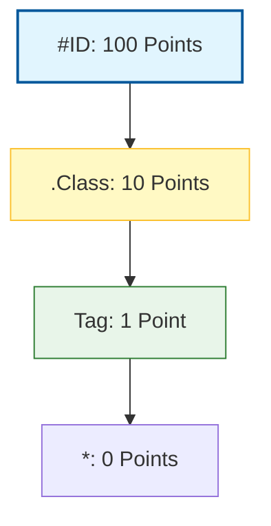

In the last lesson, we learned how to write a CSS rule. But how do we tell the browser exactly *which* element to style? We use **Selectors**.

Think of Selectors like a guest list for a party:
* You can invite everyone (Universal).
* You can invite people by their last name (Tag).
* You can invite people wearing a specific badge (Class).
* You can invite one specific person by their ID card (ID).

## 1. The Basic Three

These are the selectors you will use 99% of the time.

### 1. Tag Selector
Targets every element of a specific type.
* **CSS:** `p { color: grey; }`
* **Result:** Every single paragraph on your website turns grey.

### 2. Class Selector (`.`)
Targets elements with a specific `class` attribute. You can use a class on many different elements.
* **HTML:** `<h2 class="highlight">Hello</h2>`
* **CSS:** `.highlight { background: yellow; }`
* **Note:** Always starts with a **dot** `.` in CSS.

### 3. ID Selector (`#`)
Targets one unique element. You should only use an ID **once** per page.
* **HTML:** `<nav id="main-menu">...</nav>`
* **CSS:** `#main-menu { background: black; }`
* **Note:** Always starts with a **hashtag** `#` in CSS.

## 2. Selector Hierarchy (Specificity)

What happens if a paragraph has a class AND an ID, and they both try to set a different color? CSS has a "Point System" to decide who wins.



> **The Rule:** The more specific the selector, the more "power" it has. An **ID** will always beat a **Class**, and a **Class** will always beat a **Tag**.

## 3. Combinators: Targeting Relationships

Sometimes you only want to style an element if it is *inside* another element.

<Tabs>
<TabItem value="descendant" label="👨‍👦 Descendant" default>
Targets all `<p>` tags that are inside a `<div>`.

```css
div p { 
    color: blue; 
}
```

</TabItem>
<TabItem value="grouping" label="👥 Grouping">
Targets multiple elements at once to save time. Use a comma.

```css
h1, h2, h3 { 
    font-family: sans-serif; 
}
```

</TabItem>
</Tabs>

## 4. Pseudo-classes: Styling States

Pseudo-classes allow you to style an element based on a **user's action**, like hovering a mouse or clicking a link.

```css
/* Change color only when the mouse hovers over a button */
button:hover {
    background-color: orange;
    cursor: pointer;
}

/* Style a link that has already been clicked */
a:visited {
    color: purple;
}
```

## Practice: The "Button Challenge"

Try this in your `style.css`:

1.  Create a button in HTML: `<button class="btn-signup">Join Now</button>`
2.  Give it a base style using the **class** selector:

    ```css title="style.css"
    .btn-signup {
        background-color: blue;
        color: white;
        padding: 10px 20px;
        border: none;
    }
    ```
3.  Add a **hover** state to make it turn green:

    ```css title="style.css"
    .btn-signup:hover {
        background-color: green;
    }
    ```

:::info Avoid IDs for Styling
Even though IDs have high power, professional developers usually stick to **Classes**. Why? Because Classes are reusable and keep your "points system" (specificity) low and easy to manage!
:::