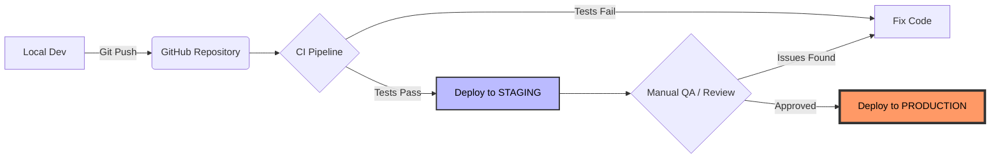

A pipeline is a series of automated steps. If any step fails, the pipeline stops, preventing "broken" code from reaching your users. In this chapter, we will dissect the anatomy of a pipeline, learn how to optimize it for speed, and understand how to handle failures like a pro.

## 1. The Anatomy of a Pipeline

A professional pipeline is divided into **Stages**, and each stage contains one or more **Jobs**.

### Stage 1: The Source (Trigger)

The pipeline begins the moment code is pushed.
*   **Best Practice:** Only run full pipelines on specific branches (like `main` or `develop`) to save server resources.

### Stage 2: The Build (Environment Setup)

This is where we prepare the application to run.
*   Installing dependencies (`npm ci`).
*   Compiling TypeScript to JavaScript.
*   Building Docker images.

### Stage 3: The Test (Quality Gate)

The most critical stage. We run:
*   **Unit Tests:** Testing individual functions.
*   **Integration Tests:** Testing how parts of the app work together.
*   **Security Scans:** Checking for vulnerable packages.

### Stage 4: The Deploy (Release)

If all tests pass, the app is pushed to the server. This can be as simple as copying files or as complex as a "Blue-Green" deployment strategy.

## 2. Parallel vs. Sequential Jobs

To be efficient, a "Master" knows when to run tasks one after another and when to run them at the same time.

*   **Sequential:** "You can't test the code before you install the dependencies." (Step A must finish before Step B).
*   **Parallel:** "You can run linting and unit tests at the same time." (Step A and Step B run simultaneously on different runners).

**GitHub Actions Example:**

```yaml title=".github/workflows/node-ci.yml"
jobs:
  lint:
    runs-on: ubuntu-latest
    steps: ...
    
  test:
    runs-on: ubuntu-latest
    needs: lint # This makes it sequential (Test waits for Lint)
    steps: ...

```

## 3. Environment Environments (Staging vs. Production)

You should never deploy directly to your main site. A robust pipeline uses **Environments**:

1. **Staging:** A mirror image of your live site where you do final manual checks.
2. **Production:** The live site used by CodeHarborHub students.

**The Workflow:**



In this setup, code is automatically deployed to a staging environment after passing tests. Only after a manual review does it get pushed to production, ensuring that CodeHarborHub's main site remains stable and reliable for all users.

## 4. Pipeline Optimization (Speed is King)

A slow pipeline kills developer productivity. Here is how to make yours lightning-fast:

* **Caching:** Store your `node_modules` so you don't have to download them every time.
* **Docker Layers:** Only rebuild the parts of your container that changed.
* **Artifacts:** If you build your frontend in the "Build" stage, save it as an **Artifact** so the "Deploy" stage can use it without rebuilding.

## 5. Handling Failures

When a pipeline fails, it shouldn't be a mystery.

* **Notifications:** Integrate your pipeline with Slack or Discord.
* **Logs:** Ensure your pipeline prints clear error messages.
* **Rollbacks:** A "Master" pipeline should have a "Panic Button" to instantly revert to the previous working version if a deployment goes wrong.

## Practice: The Multi-Job Challenge

1. Modify your GitHub Action to have two separate jobs: `build` and `test`.
2. Use the `needs` keyword to make the `test` job wait for the `build` job to finish.
3. Intentional Fail: Change a test so it fails, and observe how the pipeline stops before it can reach the (imaginary) deploy stage.

:::info Matrix Builds
Want to make sure your app works on Node.js 18, 20, and 22? Use a **Matrix Strategy** in GitHub Actions. It will launch three separate runners simultaneously to test your code against all three versions!
:::