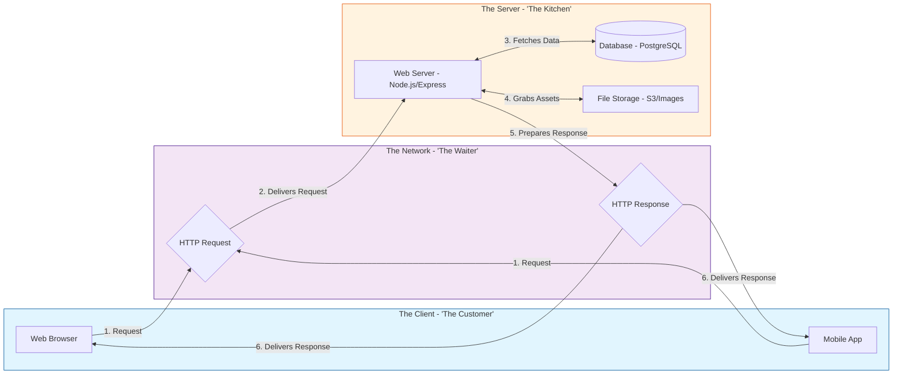
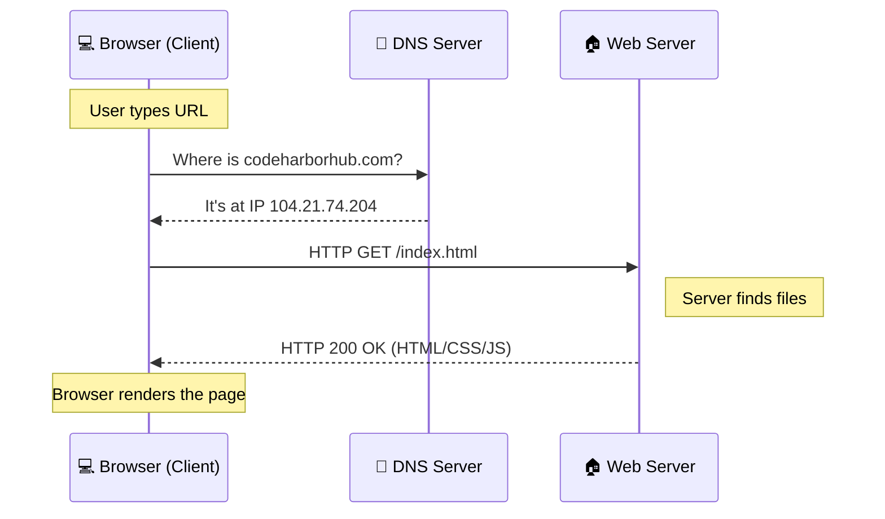

Ever wondered what happens behind the scenes when you type `www.codeharborhub.com` into your browser and hit Enter? In less than a second, a complex global dance happens. 

To build great websites, you first need to understand the **Infrastructure** of the internet

## The 3 Main Players

Imagine the Internet as a giant **Restaurant**:

1.  **The Client (You/The Customer):** The web browser on your computer or phone. You are the one making the "order."
2.  **The Server (The Kitchen):** A powerful computer sitting in a data center. It "cooks" the data and sends it back to you.
3.  **The Request/Response (The Waiter):** The message that travels between the Client and the Server.

[Image of client server model diagram]

## The Step-by-Step Journey

When you request a page, your computer follows these **6 critical steps**:

### 1. The DNS Lookup (The Phonebook)
Computers don't understand names like `google.com`; they understand numbers called **IP Addresses** (e.g., `142.250.190.46`). 
* The **DNS (Domain Name System)** acts like a phonebook, translating the URL you typed into an IP address.

### 2. TCP/IP Handshake (The Greeting)
Before sending data, your browser and the server must "introduce" themselves.
* **Client:** "Hello! Are you there?"
* **Server:** "Yes, I'm here. Are you ready to receive data?"
* **Client:** "Ready!"

### 3. HTTP Request (The Order)
Your browser sends an **HTTP Request** message. It’s like saying: *"Hey Server, please give me the file called `index.html`."*

### 4. Server Processing (The Cooking)
The server looks at the request, finds the file in its database or storage, and prepares the "ingredients" (HTML, CSS, Images).

### 5. HTTP Response (The Delivery)
The server sends back an **HTTP Response**. If everything is fine, it sends a `200 OK` status code along with the website code.

### 6. Rendering (The Plating)
Your browser receives the raw code and turns it into a beautiful, clickable website.

## Visualizing the Flow

## The "Big Three" Files

Every website you visit is made of three fundamental technologies:

| Technology | Role | Analogy |
| :--- | :--- | :--- |
| **HTML** | **Structure** | The skeleton and bricks of a house. |
| **CSS** | **Style** | The paint, furniture, and decorations. |
| **JavaScript** | **Behavior** | The electricity, plumbing, and smart locks. |

## Common Questions (FAQ)

<Tabs>
<TabItem value="ip" label="What is an IP?" default>
An <strong>IP Address</strong> is a unique set of numbers that identifies your computer on the internet. Think of it as your digital home address.

</TabItem>
<TabItem value="https" label="HTTP vs HTTPS?">
<strong>HTTP</strong> is the standard protocol. <strong>HTTPS</strong> is the Secure version. It encrypts the data so hackers can't "eavesdrop" on your password or credit card info.
 <em>(At CodeHarborHub, we always use HTTPS!)</em>

</TabItem>
<TabItem value="hosting" label="What is Hosting?">
<strong>Hosting</strong> is basically renting a space on a powerful computer (Server) that stays on 24/7 so anyone in the world can visit your site at any time.
</TabItem>
</Tabs>

:::danger Why does this matter?
As a Full-Stack Engineer, you will face "Bugs." Understanding this flow helps you realize if the bug is in the **Client** (UI issue), the **Server** (Logic issue), or the **Network** (Connection issue).
:::

:::tip The Network Tab
Want to see this in real action? Open your browser, right-click anywhere, select **Inspect**, and go to the **Network** tab. Refresh the page and watch the "Waiters" (Requests) flying back and forth!
:::