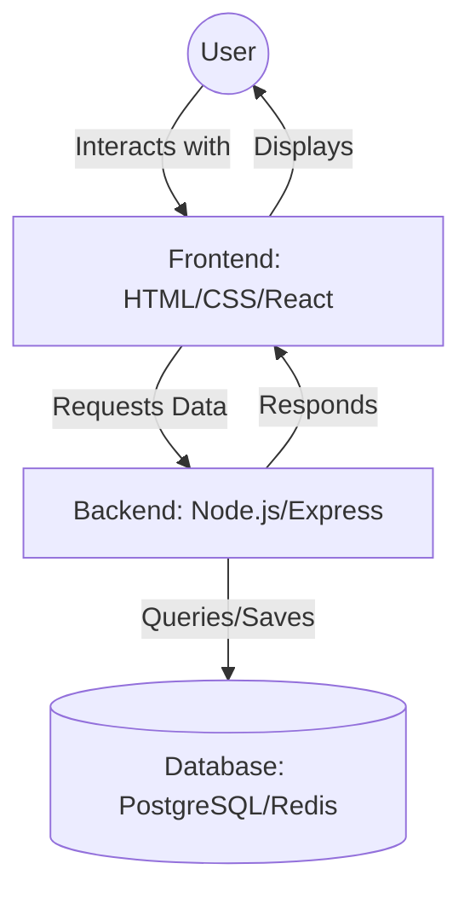

Welcome to **CodeHarborHub**! You are about to embark on a journey that transforms you from a code enthusiast into a **Full-Stack Software Engineer**. 

In the modern tech world, being "Full-Stack" means you possess the superpower to take an idea from a simple sketch to a fully functional, globally deployed application.

## What is a Full-Stack Engineer?

A Full-Stack Engineer is a developer who can handle both the **client-side** (what users see) and the **server-side** (the hidden logic and databases). 

At **CodeHarborHub**, we believe that mastering both sides of the stack gives you a deeper understanding of how web applications work and makes you a more versatile developer.

## The Mastery Roadmap

Our curriculum is divided into three major pillars to ensure you build a rock-solid foundation:

<Tabs>
<TabItem value="frontend" label="Frontend" default>

Focuses on the <strong>User Experience (UX)</strong>. You'll learn how to build beautiful, responsive interfaces using:

* HTML5 & Semantic Web
* CSS3 & Tailwind CSS
* React.js & State Management

</TabItem>
<TabItem value="backend" label="Backend">
Focuses on the <strong>Logic & Data</strong>. You'll learn how to build the "brain" of the application using:

* Node.js & Express
* RESTful APIs & JWT Auth
* PostgreSQL & Redis

</TabItem>
<TabItem value="devops" label="DevOps">
Focuses on <strong>Deployment & Scale</strong>. You'll learn how to ship your code to the world using:

* Linux & AWS Services
* GitHub Actions (CI/CD)
* Infrastructure as Code (Terraform/Ansible)

</TabItem>
</Tabs>

## Why CodeHarborHub?

| Feature | What You Get |
| :--- | :--- |
| **Project-Based** | You don't just watch; you build real-world SaaS, E-commerce, and Auth systems. |
| **Industry Ready** | We teach tools used by top tech companies (AWS, Redis, Ansible). |
| **Open Source** | Learn to collaborate on GitHub, just like real engineering teams. |
| **Clean Code** | We emphasize software design patterns and system design from day one. |

## Prerequisites

Before you start, make sure you have:

1.  **A Curious Mind:** The ability to ask "How does this work?"
2.  **Persistence:** Coding involves a lot of trial and error.
3.  **Hardware:** A laptop/PC with at least 8GB RAM (preferred) and a stable internet connection.

## How to Use These Docs

  * **Follow the Sequence:** The modules are sequenced to build on each other. Start with "Getting Started". Try not to skip ahead!
  * **Check the Callouts:** Pay attention to the special boxes throughout the tutorials:

:::tip
Look for these boxes to find industry shortcuts and "clean code" advice. They contain insights that will save you hours of frustration and help you write better code.
:::

:::danger Warning
Pay attention to these to avoid common security pitfalls or performance bottlenecks.
:::

:::info Community First
If you get stuck, remember that **CodeHarborHub** is a community. Reach out on our GitHub Discussions or join our developer community to seek help from mentors and peers.
:::