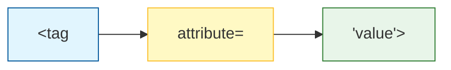

If HTML tags are the "Bones," then **Attributes** are the specific details about those bones (like their length or color), and **Links** are the joints that connect everything together.

## 1. What are Attributes?

Attributes provide **additional information** about an element. they always appear in the **opening tag** and usually come in name/value pairs like `name="value"`.



### Common Global Attributes:

  * **`id`**: A unique identifier for an element (used for styling or JS).
  * **`class`**: A non-unique identifier used to group similar elements.
  * **`title`**: Shows a "tooltip" when you hover over the element.
  * **`style`**: Used to add inline CSS (though we prefer external files!).


## 2. Creating Links (`<a>`)

The `<a>` (Anchor) tag is what makes the web a "web." It allows you to jump from one page to another. To work, it requires the `href` (Hypertext Reference) attribute.

```html
<a href="https://codeharborhub.github.io">Visit CodeHarborHub</a>
```

### Target Attribute: Opening in New Tabs

By default, links open in the same tab. To open a link in a new tab, use the `target` attribute:

```html
<a href="https://google.com" target="_blank">Open Google in New Tab</a>
```

## 3. Absolute vs. Relative Paths

This is the most common place where beginners get stuck. Understanding where your files live is crucial.

<Tabs>
<TabItem value="abs" label="🌐 Absolute Paths" default>
Points to a full URL on the internet.
<br />
`href="https://google.com"`

<br />

 Use this when linking to **external** websites.
</TabItem>
<TabItem value="rel" label="📁 Relative Paths">
Points to a file **inside your own project**.
<br />
`href="contact.html"`
<br />
Use this when linking between pages of your **own** site.
</TabItem>
</Tabs>

## 4. Special Links: Email & Phone

You can create links that automatically open the user's email client or dial a phone number.

```html
<a href="mailto:codeharborhub@gmail.com">Email Us</a>

<a href="tel:+919876543210">Call Support</a>
```

## 5. The Image Tag (``)

Images are unique because they are **self-closing** and rely entirely on attributes to work.

```html

```

  * **`src`**: The path to the image file.
  * **`alt`**: **Mandatory.** Descriptive text for screen readers or if the image fails to load.
  * **`width/height`**: Sets the size (usually handled in CSS, but good for performance).

## Interactive Practice

1.  Create a link to your favorite website that opens in a **new tab**.
2.  Create a second page called `about.html` in your folder.
3.  In `index.html`, create a **relative link** that goes to `about.html`.
4.  Add an image to your page and give it a helpful `alt` description.

:::warning The Alt Attribute
Never leave the `alt` attribute empty. If an image is just for decoration, use `alt=""`. If it contains information, describe it\! This is a core part of **Web Accessibility**.
:::