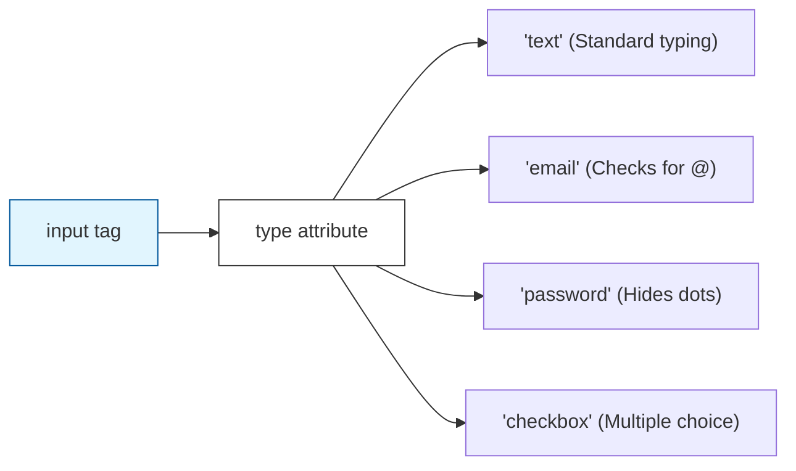

Forms are how we "talk" back to a website. Every time you type a search query, log into Facebook, or fill out a contact form, you are using HTML Forms.

## 1. The Form Container (`<form>`)

All input elements must stay inside a `<form>` tag. This tag acts as a wrapper that tells the browser where to send the data when the "Submit" button is clicked.

```html
<form action="/submit-data" method="POST">
...
</form>
````

  * **`action`**: The URL (destination) where the data should be sent.
  * **`method`**: How the data is sent (usually `GET` for searching or `POST` for sensitive data like passwords).

## 2. The Anatomy of an Input

The `<input>` tag is unique because its behavior changes completely based on its `type` attribute.



### The Label Tag (`<label>`)

**Crucial Rule:** Never use an input without a `<label>`. Labels make your forms accessible to screen readers and allow users to click the text to focus on the input.

```html
<label for="username">Username:</label>
<input type="text" id="username" name="user_login">
```

* *Note: The `for` attribute in the label must match the `id` of the input.*

## 3. Common Input Types

<Tabs>
<TabItem value="text" label="⌨️ Text & Passwords" default>

```html
<input type="text" placeholder="Enter Name">

<input type="password" placeholder="Enter Password">
```

</TabItem>
<TabItem value="choice" label="🔘 Choices">

```html
<input type="radio" id="male" name="gender">
<label for="male">Male</label>

<input type="checkbox" id="terms">
<label for="terms">I agree to terms</label>
```

</TabItem>
<TabItem value="dropdown" label="🔽 Dropdowns">

```html
<label>Choose a City:</label>
<select name="city">
  <option value="indore">Indore</option>
  <option value="bhopal">Bhopal</option>
  <option value="mumbai">Mumbai</option>
</select>
```

</TabItem>
</Tabs>

## 4. The Submit Button

A form isn't complete without a way to send it. We use the `<button>` tag or an `<input type="submit">`.

```html
<button type="submit">Send Message 🚀</button>
```

## Putting it All Together: A Registration Form

Copy this into your `index.html` to see a real-world example:

```html
<h2>Join CodeHarborHub</h2>
<form>
  <div>
    <label for="fname">Full Name:</label><br>
    <input type="text" id="fname" required>
  </div>
  
  <br>

  <div>
    <label for="email">Email Address:</label><br>
    <input type="email" id="email" required>
  </div>

  <br>

  <div>
    <label>Level of Experience:</label><br>
    <input type="radio" name="lvl" id="beg"> <label for="beg">Beginner</label>
    <input type="radio" name="lvl" id="pro"> <label for="pro">Pro</label>
  </div>

  <br>

  <button type="submit">Create Account</button>
</form>
```

:::info Validation
Did you notice the `required` attribute in the code above? This is called **HTML5 Validation**. It tells the browser not to let the user submit the form if the field is empty—all without needing any JavaScript!
:::