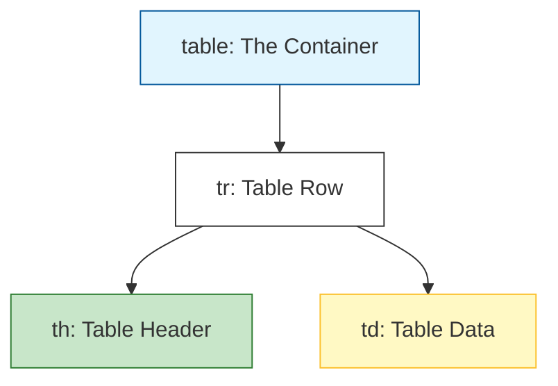

Tables are used to display **tabular data**—information that is best understood in a grid format, like a bus schedule, a price list, or a leaderboard.

## 1. The Table Hierarchy

An HTML table is built using a "Nested" structure. You can't just throw data into a table; you have to define the table, then the row, and then the specific cell.



### The Basic Tags:

  * **`<table>`**: The main wrapper for all table content.
  * **`<tr>`**: Stands for **Table Row**. Every horizontal line of data needs a row.
  * **`<th>`**: Stands for **Table Header**. These cells are bold and centered by default.
  * **`<td>`**: Stands for **Table Data**. These are the standard cells in your table.

## 2. Building a Simple Table

```html
<table>
  <tr>
    <th>Course</th>
    <th>Duration</th>
    <th>Instructor</th>
  </tr>
  <tr>
    <td>HTML Basics</td>
    <td>2 Weeks</td>
    <td>CodeHarborHub</td>
  </tr>
  <tr>
    <td>CSS Styling</td>
    <td>3 Weeks</td>
    <td>John Doe</td>
  </tr>
</table>
```

## 3. Advanced Structure: Thead, Tbody, and Tfoot

For larger tables, we group rows into semantic sections. This helps screen readers and allows developers to style the header and footer differently.

  * **`<thead>`**: Wraps the header rows.
  * **`<tbody>`**: Wraps the main body of data.
  * **`<tfoot>`**: Wraps the summary or total row at the bottom.

```html
<table>
  <thead>
    <tr>
      <th>Product</th>
      <th>Price</th>
    </tr>
  </thead>
  <tbody>
    <tr>
      <td>Web Hosting</td>
      <td>$10</td>
    </tr>
  </tbody>
  <tfoot>
    <tr>
      <td>Total</td>
      <td>$10</td>
    </tr>
  </tfoot>
</table>
```

## 4. Spanning Rows and Columns

Sometimes a cell needs to take up more than one "slot." We use two special attributes for this:

<Tabs>
<TabItem value="colspan" label="↔️ Colspan" default>
**Column Span:** Merges cells horizontally across multiple columns.
<br />
<code>&lt;td colspan="2"&gt;Double Wide Cell&lt;/td&gt;</code>
</TabItem>
<TabItem value="rowspan" label="↕️ Rowspan">
**Row Span:** Merges cells vertically across multiple rows.
<br />
<code>&lt;td rowspan="2"&gt;Double Tall Cell&lt;/td&gt;</code>
</TabItem>
</Tabs>

## Interactive Practice

Try to create a "Student Gradebook" in your `index.html`:

1.  Create a table with 3 columns: **Subject**, **Marks**, and **Grade**.
2.  Add at least 3 rows of data.
3.  Use `<th>` for the top row to make the titles stand out.
4.  Add a `border="1"` attribute to the `<table>` tag just to see the grid (Note: We usually do this in CSS, but it helps for learning\!).

:::warning A Critical Rule
**Never use tables for page layouts.** In the 1990s, developers used tables to place sidebars and headers. Today, we use **Flexbox** or **Grid** in CSS for layouts. Tables should only be used for actual data!
:::

:::info Accessibility
Always include a `<caption>` tag immediately after the opening `<table>` tag. It acts like a title for the table, helping users with screen readers understand what they are about to read.
:::