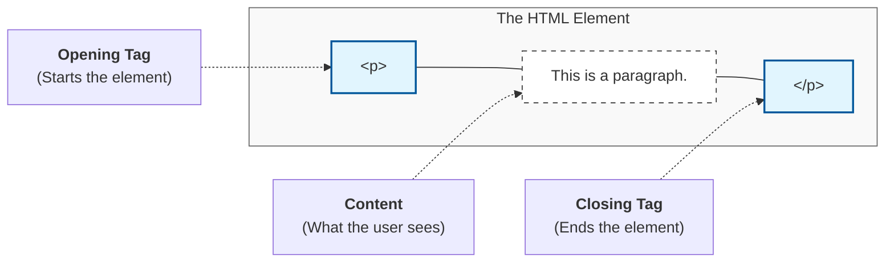

**HTML** stands for **HyperText Markup Language**. It is the standard language used to create the structure of web pages. 

Think of a website like a human body:
* **HTML** is the **Skeleton** (The bones and structure).
* **CSS** is the **Skin/Clothes** (The beauty and style).
* **JavaScript** is the **Muscle/Brain** (The movement and logic).

## 1. What is "Markup"?

Markup is a way of "tagging" plain text so that a web browser knows how to display it. 

If you just type text, the browser doesn't know if it's a heading, a link, or a list. We use **Tags** to provide that context.

## 2. The Anatomy of an HTML Element

Most HTML elements follow a simple pattern: an **Opening Tag**, the **Content**, and a **Closing Tag**.



:::warning Don't Forget the Slash!
The closing tag is identical to the opening tag but starts with a forward slash `/`. Forgetting this is the #1 reason why beginners' websites look "broken."
:::

## 3. The Standard Page Structure

Every HTML document must follow a specific "Boilerplate" structure. Without these tags, the browser might get confused about how to render your page.

```html title="index.html"
<!DOCTYPE html>
<html lang="en">
<head>
    <meta charset="UTF-8">
    <meta name="viewport" content="width=device-width, initial-scale=1.0">
    <title>My First Web Page</title>
</head>
<body>
    <h1>Hello CodeHarborHub!</h1>
    <p>I am learning how to build the web.</p>
</body>
</html>
```

### Breaking it Down:

  * **`<!DOCTYPE html>`**: Tells the browser "Hey, I'm using the latest version of HTML (HTML5)."
  * **`<html>`**: The "Root" element that wraps everything.
  * **`<head>`**: Contains metadata (info about the page) that doesn't show up on the screen.
  * **`<body>`**: Everything inside here is what the user actually sees.

## Block vs. Inline Elements

HTML elements generally fall into two categories. Understanding this will save you hours of CSS frustration later!

<Tabs>
<TabItem value="block" label="📦 Block Level" default>
These always start on a **new line** and take up the full width available.
* <code>&lt;h1&gt;</code> to <code>&lt;h6&gt;</code>
* <code>&lt;p&gt;</code> (Paragraph)
* <code>&lt;div&gt;</code> (Generic container)
</TabItem>
<TabItem value="inline" label="🔗 Inline">
These do **not** start on a new line. They only take up as much width as necessary.
* <code>&lt;a&gt;</code> (Links)
* <code>&lt;span&gt;</code> (Small text bits)
* <code>&lt;img&gt;</code> (Images)
</TabItem>
</Tabs>

## Your First Task: "The Boilerplate"

Let's use the environment we set up in the previous module!

1.  Open **VS Code**.
2.  Create a new file named `index.html`.
3.  **Pro Tip:** Type `!` (exclamation mark) and hit `Tab`.
4.  VS Code will automatically generate the entire boilerplate for you! This is called **Emmet**, and it's a developer's best friend.

:::info Why HTML is Important
Even if you become a world-class React or Vue developer, you are still ultimately writing HTML. A solid understanding of HTML structure leads to better **SEO** (Search Engine Optimization) and **Accessibility** (helping blind or visually impaired users read your site).
:::