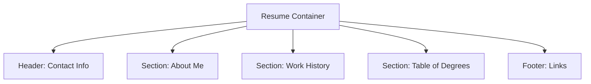

It's time to take off the training wheels! To master HTML, you need to build. These projects focus purely on **structure, semantics, and accessibility**. 

**The Challenge:** Build these using *only* HTML. No CSS allowed yet!

## Project 1: The Professional Technical Resume

Every developer needs a resume. Instead of using a Word document, you will build yours using semantic HTML. This makes it readable by "Applicant Tracking Systems" (ATS).

### Requirements:
* **Header:** Use `<header>` for your name, a professional title, and links to your GitHub/LinkedIn.
* **Experience:** Use `<section>` for each job and `<ul>` for your responsibilities.
* **Education:** Use a `<table>` to list your Degree, Institution, and Year.
* **Skills:** Use a "Description List" (`<dl>`, `<dt>`, `<dd>`) to categorize your skills.

## Project 2: The "Survey & Feedback" Form

Forms are the most complex part of HTML. This project ensures you know how to handle different types of user data.

### Requirements:

  * **Personal Info:** Text inputs for Name and Email (use `required`).
  * **Rating:** A group of `radio` buttons (1 to 5 stars).
  * **Features:** `checkboxes` for "Which topics do you want to learn?" (HTML, CSS, JS).
  * **Feedback:** A `<textarea>` for long-form comments.
  * **Submit:** A `<button type="submit">` that says "Send Feedback."

:::tip Accessibility Check
Make sure every input has a matching `<label>` with a `for` attribute\!
:::

## Project 3: The "Recipe Book" Page

This project tests your ability to use nested lists and media elements.

### Requirements:

  * **Title:** Use an `<h1>` for the recipe name.
  * **Overview:** A `<figure>` containing an image of the food and a `<figcaption>`.
  * **Ingredients:** An **Unordered List** (`<ul>`).
  * **Instructions:** An **Ordered List** (`<ol>`) for the steps.
  * **Nutrition:** A `<table>` showing Calories, Protein, and Carbs.

## How to Submit (For CodeHarborHub Learners)

1.  **Create a Folder:** Name it `html-mini-projects`.
2.  **Create Files:** Name them `resume.html`, `survey.html`, and `recipe.html`.
3.  **Validate:** Go to the [W3C HTML Validator](https://validator.w3.org/) and paste your code. Fix any red errors!
4.  **Share:** Upload your code to a GitHub repository and share the link with the community.

## Project Showcase: What to expect?

Remember, without CSS, your projects will look like websites from 1992. **That is okay!** If your code is:

1.  **Semantic** (Uses `<main>`, `<article>`, etc.)
2.  **Valid** (No broken tags)
3.  **Accessible** (Has `alt` text and labels)

...then you have successfully mastered HTML. You are now ready to make these projects look stunning in the next track.

:::info Instructor Note
When you move to the **CSS Track**, we will come back to these exact files and add colors, fonts, and layouts to turn them into modern web applications.
:::