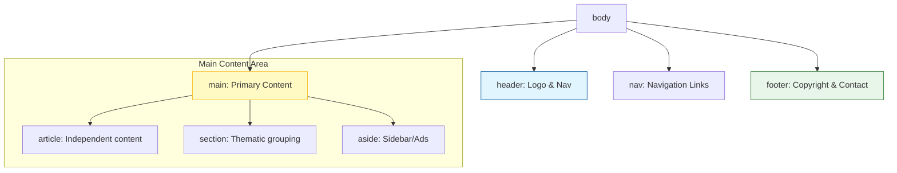

In our previous lessons, we used tags like `<div>` and `<span>`. These are **non-semantic**—they tell the browser nothing about the content inside them.

**Semantic HTML** uses tags that clearly describe their meaning to both the browser and the developer. 

## 1. Why Semantics Matter?

Imagine looking at a newspaper where every font size was exactly the same. You wouldn't know what the headline is, where the article starts, or where the footer is. 

### The Three Pillars of Semantics:
1.  **Accessibility:** Screen readers use these tags to help visually impaired users navigate your site (e.g., "Skipping to main content").
2.  **SEO (Search Engine Optimization):** Google gives higher rankings to pages where the important content is wrapped in semantic tags.
3.  **Readability:** It’s much easier for a teammate to read `<header>` than `<div class="top-part-of-site">`.

## 2. The Semantic Structure

Instead of using `<div>` for everything, we use specific tags for specific areas of the page.



## 3. Key Semantic Tags

<Tabs>
<TabItem value="structure" label="🧱 Structure" default>

| Tag | Purpose |
| :--- | :--- |
| `<header>` | The introductory content (logo, search, nav). |
| `<nav>` | A block of navigation links. |
| `<main>` | The unique, central content of the document. |
| `<footer>` | The "bottom" information (legal, social links). |

</TabItem>
<TabItem value="content" label="📄 Content">

| Tag | Purpose |
| :--- | :--- |
| `<article>` | A self-contained piece of content (like a blog post or news story). |
| `<section>` | A group of related content (like a "Features" or "Contact Us" section). |
| `<aside>` | Content indirectly related to the main piece (sidebars, pull quotes). |
| `<figure>` | Used for images, diagrams, or code snippets with a `<figcaption>`. |

</TabItem>
</Tabs>

## 4. Comparison: Div Soup vs. Semantic

### The "Div Soup" (Bad Practice)

```html
<div id="header">
  <div id="nav">...</div>
</div>
<div id="content">
  <div class="post">...</div>
</div>
<div id="footer">...</div>
```

### Semantic HTML (CodeHarborHub Standard)

```html
<header>
  <nav>...</nav>
</header>
<main>
  <article>...</article>
</main>
<footer>...</footer>
```

## Let's Practice

Refactor your current `index.html` project. Wrap your title and navigation in a `<header>`, put your main lists and text inside a `<main>` tag, and add a small `<footer>` with your name and the current year.

:::tip The "Article" Test
If you can take a piece of content, put it on a completely different website, and it **still makes sense** on its own, it should probably be an `<article>`. If it only makes sense as part of the page it's on, use a `<section>`.
:::

:::info Accessibility
When you use a `<button>` tag instead of a `<div>` with a click listener, you automatically get keyboard support (users can hit "Enter" to click). This is the power of using the correct semantic tag!
:::