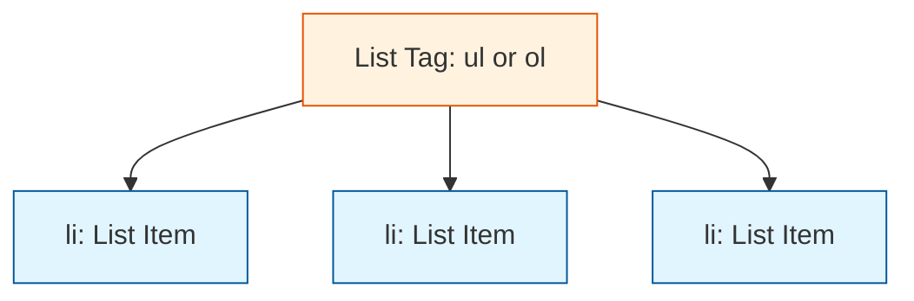

Now that you have your "Skeleton" (the boilerplate), it's time to add the "Bones." In HTML, we use different tags to tell the browser exactly what kind of content we are displaying.

## 1. Headings (`<h1>` to `<h6>`)

Headings are used to define the hierarchy of your content. They range from `<h1>` (most important) to `<h6>` (least important).

```html title="index.html"
<h1>This is a Main Title</h1>
<h2>This is a Subtitle</h2>
<h3>This is a Section Heading</h3>
```

:::info SEO & Accessibility Tip
Always use only **one** `<h1>` per page. Search engines like Google use it to understand the main topic of your site. Don't skip levels (e.g., going from `<h1>` straight to `<h3>`) as it confuses screen readers for visually impaired users.
:::

## 2. Paragraphs and Formatting

The `<p>` tag is used for blocks of text. Inside these, we can add "emphasis" tags.

| Tag | Result | Purpose |
| :--- | :--- | :--- |
| `<p>` | Standard text | Defining a paragraph. |
| `<strong>` | **Bold text** | Important information. |
| `<em>` | *Italic text* | Emphasis or stress. |
| `<br />` | Line break | Forces a new line (Self-closing). |

## 3. Lists: Organizing Information

There are two main types of lists in HTML. Think of them as "Shopping Lists" vs. "Cooking Instructions."

<Tabs>
<TabItem value="ul" label="⚫ Unordered List" default>
Used for items where the order **doesn't matter** (Bullet points).

```html title="index.html"
<ul>
  <li>HTML</li>
  <li>CSS</li>
  <li>JavaScript</li>
</ul>
```

</TabItem>
<TabItem value="ol" label="🔢 Ordered List">
Used for items where the **sequence is key** (Numbered list).

```html title="index.html"
<ol>
  <li>Step 1: Write Code</li>
  <li>Step 2: Save File</li>
  <li>Step 3: Refresh Browser</li>
</ol>
```

</TabItem>
</Tabs>



## 4. Structural Containers (`<div>` and `<span>`)

Sometimes we need to group elements together for styling without changing the "meaning" of the text.

  * **`<div>` (Block):** Used to group large sections. It always starts on a new line. Think of it as a "Box."
  * **`<span>` (Inline):** Used to wrap small parts of text inside a paragraph. It stays on the same line.

```html title="index.html"
<div>
  <h2>User Profile</h2>
  <p>Status: <span style="color: green">Active</span></p>
</div>
```

## Interactive Practice

Try combining everything you've learned into your `index.html` file:

1.  Create an `<h1>` with your name.
2.  Add an `<h2>` titled "My Learning Goals."
3.  Create an **ordered list** of 3 languages you want to learn.
4.  Wrap one word in your list with `<strong>`.

:::tip The "Self-Closing" Rule
Most tags come in pairs, but some don't have content (like images or line breaks). These are called **Self-Closing** tags.
Example: `<br />` or `<hr />` (Horizontal Rule). You don't need a `</br>`.
:::