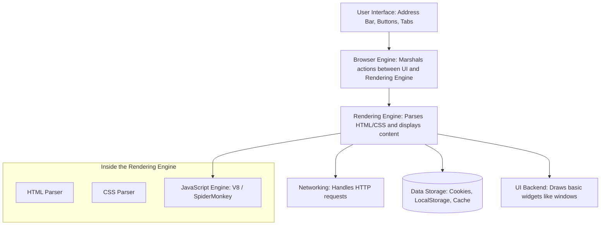
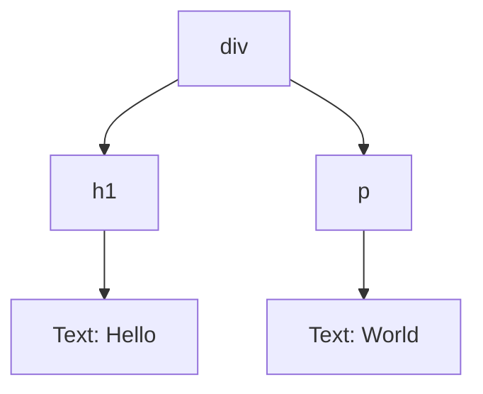
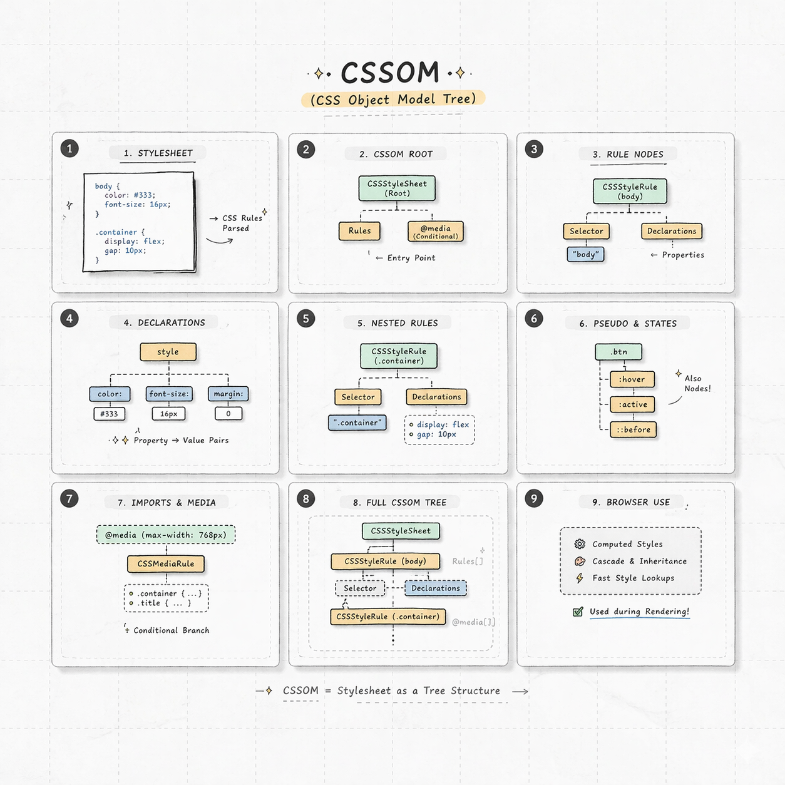
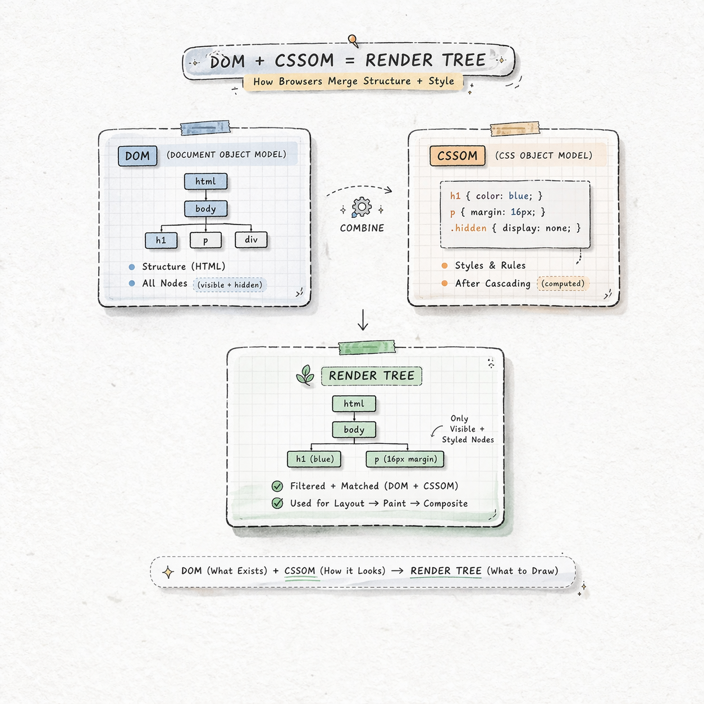
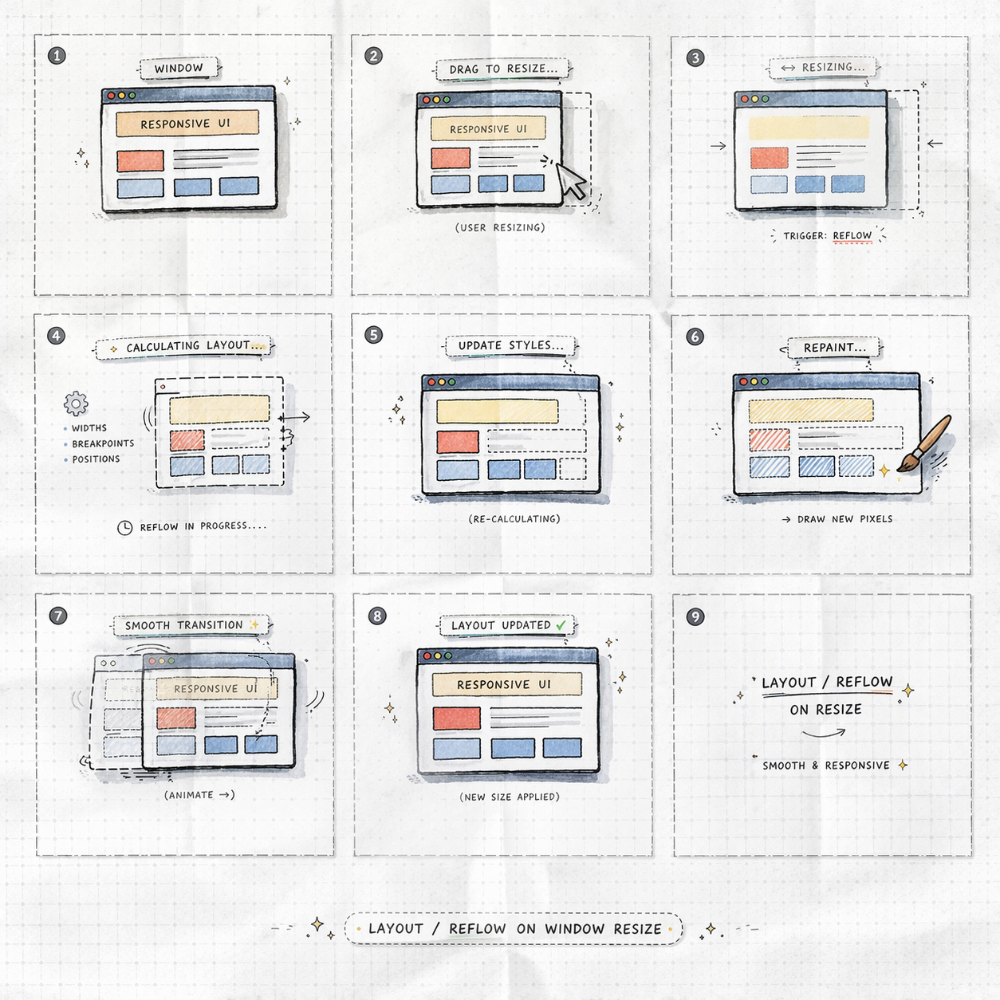

You probably use a browser (Chrome, Firefox, Safari) for hours every day. But to a **Full-Stack Engineer**, a browser is not just a tool; it is a complex execution environment. 

Its single, massive job is called **Parsing and Rendering**: taking raw text files from a server and turning them into the visual, clickable experience you see on your screen.

## 1. The Browser's High-Level Architecture

A modern browser is like a mini-operating system. It has many components working together:



## 2. The Critical Rendering Path (CRP)

This is the sequence of steps the browser takes to convert HTML, CSS, and JavaScript into pixels on the screen. Understanding this is **key to website performance**.


### The 5 Stages of Rendering:

<Tabs>
<TabItem value="dom" label="1. DOM Tree" default>

The browser parses the HTML and builds the **Document Object Model (DOM)**. This is a tree-like map of all your HTML tags.

**HTML:**

```html
<div>
  <h1>Hello</h1>
  <p>World</p>
</div>
```

**Resulting DOM Tree:**



</TabItem>
<TabItem value="cssom" label="2. CSSOM Tree">

While building the DOM, the browser also parses all CSS (from `<style>` tags and external files) to build the **CSS Object Model (CSSOM)**. This tree contains all the styling rules for your elements.



</TabItem>
<TabItem value="render" label="3. Render Tree">

The browser combines the DOM and the CSSOM into a **Render Tree**.

  * **Crucial:** The Render Tree *only* contains elements that will be visible. Anything with `display: none` is **not** in this tree.



</TabItem>
<TabItem value="layout" label="4. Layout (Reflow)">

Now the browser knows *what* to show, it needs to know **where** to show it. The **Layout** stage calculates the exact coordinates and size (width, height) of every element on the screen.

*This stage is re-run (called a **Reflow**) whenever you resize the window or change an element's size with JavaScript.*



</TabItem>
<TabItem value="paint" label="5. Painting">

The final stage! The browser takes the calculated layout and **paints** the actual pixels onto the screen (colors, text, images, borders, shadows).

*This stage is re-run (called a **Repaint**) when you change the color or visibility of an element without changing its layout.*

</TabItem>
</Tabs>

## 3. The JavaScript Engine: Making it Interactive

JavaScript is the third piece of the puzzle. The browser passes all JS code to its specialized **JavaScript Engine** (like V8 in Chrome).

  * **The Problem:** By default, JavaScript is **Parser-Blocking**. When the HTML parser sees a `<script>` tag, it stops *everything*, downloads the JS file, runs it, and *then* continues parsing the HTML.
  * **The Solution:** We use attributes like `async` or `defer` to tell the browser not to block the page rendering.

## 4. Let's Explore: The Chrome Developer Tools (DevTools)

Every browser has powerful tools built-in for developers. Press `F12` or `Right-Click > Inspect` right now!

| Tab | What it's for | Analogy |
| :--- | :--- | :--- |
| **Elements** | Live view of the **DOM Tree** and **CSSOM**. You can edit code here and see changes instantly. | The interactive map of your page. |
| **Console** | Logs errors, warnings, and allows you to run **JavaScript** live. | Your direct line of communication to the browser. |
| **Network** | Shows every file (HTML, CSS, JS, Image) the browser requests from the server and how long it takes. | The logistics manager for your page assets. |
| **Performance**| Records the rendering process to find what is slowing down your page (e.g., long **Layout** times). | The stop-watch and diagnostic tool. |

:::tip The Inspect Trick
Need to fix a typo or test a new color on a live site? Use the **Elements** tab to edit the HTML/CSS directly. The change only happens on *your* screen, not on the server, but it's perfect for rapid prototyping.
:::

:::info Summary for Learners
The browser turns raw code into a DOM (Structure) and CSSOM (Style), combines them into a Render Tree, calculates their positions (Layout), and draws them (Paint). JavaScript can modify this process but must be managed carefully for performance.
:::