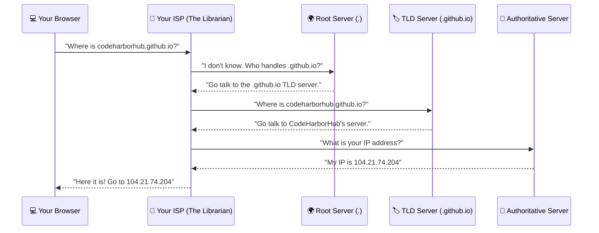

Computers are great with numbers, but humans are better with names. 

If you want to visit a friend, you look for their name in your contacts—you don't memorize their exact GPS coordinates. The **DNS (Domain Name System)** does exactly this for the internet.

## 1. Names vs. Numbers

Every device connected to the internet has a unique "Home Address" called an **IP Address** (e.g., `142.250.190.46`). 

* **The Problem:** Nobody wants to type `142.250.190.46` to check their email.
* **The Solution:** We type `google.github.io`, and the DNS instantly swaps that name for the correct number.

## 2. The Step-by-Step Lookup

When you type a URL into your browser, a high-speed search happens behind the scenes. Think of it like asking for directions in a library:

## 3. The Four Key Players

To make this simple, let's look at the "Chain of Command" in the DNS world:

1.  **The Recursive Resolver (The Librarian):** This is usually provided by your Internet Provider (ISP). It is the one that goes and finds the answer for you so you don't have to.
2.  **The Root Server (The Directory):** The first stop. It doesn't know the address, but it knows where all the "Zip Codes" (.github.io, .org, .in) are located.
3.  **The TLD Server (The Section):** TLD stands for "Top Level Domain." This server handles a specific group, like all `.github.io` websites.
4.  **The Authoritative Name Server (The Owner):** This is the final stop. It belongs to the website owner and has the exact IP address.

## 4. Common DNS Concepts

<Tabs>
<TabItem value="records" label="📜 DNS Records" default>
DNS isn't just one setting. It's a list of instructions:

* **A Record:** Maps a domain to an IPv4 address (The most common).
* **AAAA Record:** Maps a domain to the newer, longer IPv6 address.
* **CNAME:** Forwards one domain to another (e.g., `www` to `root`).
* **MX Record:** Tells the internet where to send your **Emails**.

</TabItem>
<TabItem value="cache" label="⚡ DNS Caching">

To make things faster, your computer and browser **remember** the IP address after the first visit. This is called "Caching." Next time you visit, it doesn't need to ask the Librarian; it just goes straight there!
</TabItem>
<TabItem value="prop" label="⏳ Propagation">
When you change your website's IP, it takes time for the "news" to spread across all Librarians in the world. This usually takes **1 to 24 hours**.
</TabItem>
</Tabs>

## Let's Try it! (No Jargon Tool)

You can see the DNS working right now using a tool called `nslookup`.

1.  Open your **Terminal**.
2.  Type: `nslookup codeharborhub.github.io`
3.  You will see the **Address**—that is the "Computer Number" where our site lives!

:::tip Success Checklist
* If the domain name is the **Name**, the DNS is the **Phonebook**, and the IP is the **Phone Number**.
* Without DNS, we would have to memorize thousands of random numbers to browse the web.
:::

:::info Tip for Developers
When your website says "Site Not Found" right after you bought a domain, 99% of the time, it's because the **DNS Propagation** isn't finished yet. Grab a coffee and wait\! ☕
:::