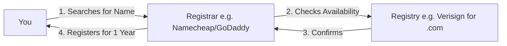

If **Hosting** is your house, and the **IP Address** is your GPS coordinates, then the **Domain Name** is your street address (e.g., *123 Code Lane*). It’s the human-friendly way to find your corner of the internet.

## 1. The Anatomy of a URL

Most people think `www.google.com` is just one thing. Actually, it is made of several distinct parts that work together.

Let's break down `https://blog.codeharborhub.com`:

1.  **Protocol (`https://`):** The secure "language" being used to talk.
2.  **Subdomain (`blog`):** A sub-section of your main site. You can have as many as you want (e.g., `app`, `dev`, `shop`).
3.  **Domain Name (`codeharborhub`):** The unique name you purchased (The SLD - Second Level Domain).
4.  **TLD (`.com`):** The "Top-Level Domain" or extension.

## 2. Understanding TLDs (The Extensions)

The TLD tells the user (and the search engine) what kind of "neighborhood" the website belongs to.

<Tabs>
  <TabItem value="generic" label="🌍 Generic (gTLDs)" default>
    <ul>
      <li><strong>.com:</strong> Originally for Commercial, now the global standard.</li>
      <li><strong>.org:</strong> Non-profits or organizations.</li>
      <li><strong>.net:</strong> Network infrastructure (common for tech).</li>
      <li><strong>.io:</strong> Popular for Tech Startups and APIs.</li>
    </ul>
  </TabItem>
  <TabItem value="country" label="🇮🇳 Country (ccTLDs)">
    <ul>
      <li><strong>.in:</strong> India</li>
      <li><strong>.us:</strong> United States</li>
      <li><strong>.uk:</strong> United Kingdom</li>
      <li><strong>.de:</strong> Germany</li>
    </ul>
  </TabItem>
  <TabItem value="specialty" label="✨ Specialty">
    <ul>
      <li><strong>.dev:</strong> Perfect for developers and portfolios.</li>
      <li><strong>.edu:</strong> Academic institutions.</li>
      <li><strong>.gov:</strong> Government agencies.</li>
    </ul>
  </TabItem>
</Tabs>

## 3. How do you "own" a Domain?

You don't actually "buy" a domain forever; you **lease** it from a **Domain Registrar**.

### Popular Registrars for Developers:

  * **Namecheap:** Great prices and easy interface.
  * **Google Domains / Squarespace:** Very clean setup.
  * **Cloudflare:** Sells domains at cost (no markup\!).

## 4. Choosing the Right Domain

When choosing a name for your project or portfolio, follow these **CodeHarborHub** rules:

1.  **Keep it Short:** Ideally 2-3 words max.
2.  **Avoid Hyphens:** People forget them (e.g., `code-harbor-hub.com` is bad).
3.  **The "Radio Test":** If you say the name out loud, can someone spell it correctly without asking?
4.  **Stick to .com or .dev:** These carry the most trust for professional software work.

:::tip Subdomains are Free!
Once you buy `yourname.com`, you don't have to pay extra for `portfolio.yourname.com` or `api.yourname.com`. You can create unlimited subdomains through your DNS settings!
:::

:::danger Don't Get Scammed
Some registrars will try to sell you "Domain Privacy" for $15/year. Many modern registrars (like Namecheap or Cloudflare) provide this **for free**. Always check before you pay extra\!
:::