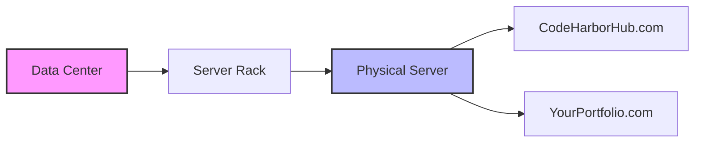

In the previous lesson, we learned that **DNS** is like a phonebook. But where does the actual "house" live? 

**Web Hosting** is the process of renting space on a powerful computer (called a **Server**) that is connected to the internet 24/7. When you "host" a website, you are putting your HTML, CSS, and JavaScript files on that server so anyone in the world can see them.

## 1. The Real Estate Analogy

The best way to understand the different types of hosting is to think of them as different types of housing.

### Shared Hosting (The Apartment)
Multiple websites live on one single server and share its resources (CPU, RAM).
* **Pros:** Very cheap, easy for beginners.
* **Cons:** If one "neighbor" gets a lot of traffic, your site might slow down.

### VPS - Virtual Private Server (The Townhouse)
One physical server is divided into several "virtual" servers. You have your own dedicated slice of the resources.
* **Pros:** More control (you can install your own software), better performance.
* **Cons:** Requires more technical knowledge to set up.

### Dedicated Hosting (The Private Mansion)
You rent the entire physical computer for yourself. No neighbors, total control.
* **Pros:** Maximum power, maximum security.
* **Cons:** Very expensive; usually only needed for massive companies.

### Cloud Hosting (The Hotel Chain)
Your website is spread across a network of hundreds of servers. 
* **Pros:** If one server fails, another takes over. You only pay for what you use.
* **Cons:** Pricing can be complex to track.

## 2. What makes a "Server" special?

You might wonder: *"Can I just host my website on my own laptop?"* Technically, yes! But professional servers are built differently:
1.  **Uptime:** They have backup power (generators) so they never turn off.
2.  **Static IP:** Their "address" never changes.
3.  **Cooling:** They live in climate-controlled "Data Centers" to prevent overheating.
4.  **Speed:** They are connected to massive internet "backbones" for lightning-fast delivery.

## Which one should you choose?

| Project Type | Recommended Hosting | Example Providers |
| :--- | :--- | :--- |
| **Personal Portfolio** | Static Hosting (Free) | GitHub Pages, Vercel, Netlify |
| **Small Business Blog**| Shared Hosting | Bluehost, HostGator |
| **Full-Stack App** | **Cloud / VPS** | **AWS**, DigitalOcean, Render |
| **Enterprise SaaS** | Managed Cloud | AWS, Google Cloud, Azure |

## 3. Key Hosting Terms

<Tabs>
<TabItem value="uptime" label="⏱️ Uptime" default>
The percentage of time a server is "up" and running. Look for **99.9% Uptime**. This means the site will only be down for a few minutes a year.
</TabItem>
<TabItem value="bandwidth" label="🚀 Bandwidth">
The amount of data that can be transferred between your site and your visitors. Think of it as the "width of the pipe."
</TabItem>
<TabItem value="ssd" label="💾 SSD Storage">
Modern hosting uses **Solid State Drives**. This makes your database queries and file loading much faster than old hard drives.
</TabItem>
</Tabs>

:::tip CodeHarborHub Favorite
For beginners in this track, we will start with **Static Hosting** (for our HTML/CSS) and then move to **Cloud Hosting** (for our Node.js and PostgreSQL apps). Most of these offer a "Free Tier" so you won't have to pay while you learn!
:::

:::danger Warning
Avoid "Free" web hosts that put their own ads on your website. They look unprofessional and often have terrible security. Stick to reputable providers like **Vercel** or **GitHub Pages**.
:::