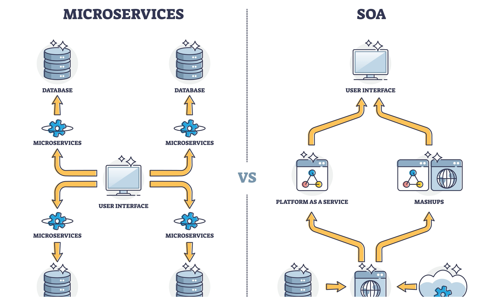

In this final lesson, we apply everything "A Master" has learned to three famous real-world architectures.

## 1. YouTube: Handling Massive Video Data

**The Challenge:** Users upload 500 hours of video every minute. How do you store them and make sure they play without buffering?

### The Architecture:
1.  **Blob Storage (S3-style):** Videos aren't stored in a database. They are stored as files in a massive distributed storage system.
2.  **Transcoding Servers:** When you upload a 4K video, YouTube's servers instantly create versions in 1080p, 720p, 480p, and 144p so people with slow internet can still watch.
3.  **CDN (Content Delivery Network):** YouTube uses its own global network (Google Global Cache) to store popular videos at "Edge Locations" right inside your local ISP's office.

## 2. Netflix: The King of Availability

**The Challenge:** Netflix accounts for 15% of all global internet traffic. If their database goes down, millions of people get angry.

### The Architecture:
1.  **Microservices:** Netflix isn't one big app. It’s over 1,000 tiny services (one for the "Search" bar, one for "Recommendations," one for "Billing"). If "Recommendations" breaks, you can still watch your movie.
2.  **Chaos Engineering:** Netflix created a tool called "Chaos Monkey" that randomly deletes their own servers in production! This forces their engineers to build systems that are **Self-Healing**.
3.  **Open Connect:** Like YouTube, Netflix places its own hardware (boxes full of movies) inside local internet providers all over the world.

## 3. WhatsApp: 2 Billion Users, 1 Goal

**The Challenge:** Handling billions of messages with "End-to-End Encryption" while ensuring they are delivered instantly.

### The Architecture:
1.  **WebSockets:** WhatsApp keeps a "Long-Lived" connection open between your phone and their server. This is why you see "Typing..." in real-time.
2.  **Message Queue:** If your friend is offline, the message is stored in a queue (like a digital post office). As soon as they turn on their data, the message is "pushed" to them and deleted from the server.
3.  **NoSQL Speed:** WhatsApp uses high-performance databases to handle the massive write-load of billions of messages per hour.

## 4. The "Master" Summary

What do all these systems have in common?

| Problem | The "Master" Solution |
| :--- | :--- |
| **Too many users?** | Add a **Load Balancer** and Scale Horizontally. |
| **Site is slow?** | Add a **Cache (Redis)** and a **CDN (CloudFront)**. |
| **Data is too big?** | Use **Database Sharding** and **S3 Storage**. |
| **System is crashing?** | Move to **Microservices** to isolate the failure. |

## Final Challenge: Design CodeHarborHub v2

Imagine CodeHarborHub suddenly gets 10 million students today. 
*   **Where would you put the videos?** (S3 + CDN)
*   **How would you handle the "Live Chat" during a workshop?** (WebSockets)
*   **How would you keep the "Course Progress" safe?** (SQL Database with Replicas)