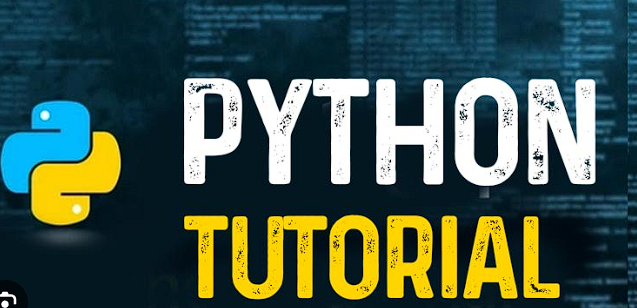

Python was created by <mark>Guido van Rossum</mark> and first released in 1991. Python is an open-source language, which means that the source code is freely available for anyone to use, modify, and distribute. Python has a large and active community of developers who contribute to the language and its ecosystem of libraries and tools.

## What is Python?

Python is a high-level, interpreted, and general-purpose programming language. Python is designed to be easy to read and write, and its simple syntax makes it a great language for beginners. Python is a versatile language that can be used for web development, data analysis, artificial intelligence, scientific computing, and more.

Python is known for its readability and simplicity, which makes it a great language for beginners to learn. Python code is easy to read and write, which can help new programmers focus on learning programming concepts rather than getting bogged down in complex syntax.

Python is an interpreted language, which means that the code is executed line by line by an interpreter. This makes it easy to write and test code quickly, without the need to compile the code before running it.

## Why Learn Python?

Python is a popular language for a variety of reasons:

- **Easy to Learn**: Python has a simple and readable syntax that makes it easy to learn and write code.
- **Versatile**: Python can be used for a wide range of applications, including web development, data analysis, artificial intelligence, scientific computing, and more.
- **Large Community**: Python has a large and active community of developers who contribute to the language and its ecosystem of libraries and tools.
- **Open Source**: Python is an open-source language, which means that the source code is freely available for anyone to use, modify, and distribute.
- **High Demand**: Python is one of the most popular programming languages in the world, and there is a high demand for Python developers in the job market.
- **Object-Oriented**: Python is an object-oriented language, which means that it supports the concepts of classes and objects, making it easy to write modular and reusable code.
- **Interpreted**: Python is an interpreted language, which means that the code is executed line by line by an interpreter, making it easy to write and test code quickly.
- **Cross-Platform**: Python is a cross-platform language, which means that it can run on multiple operating systems, including Windows, macOS, and Linux.
- **Extensive Libraries**: Python has a large standard library that provides support for a wide range of tasks, as well as a vast ecosystem of third-party libraries and tools.
- **Scalable**: Python is a scalable language that can be used for small scripts as well as large applications.
- **Community Support**: Python has a large and active community of developers who provide support and resources for learning and using the language.

## What can python do?

Python is a versatile language that can be used for a wide range of applications, including:

- **Web Development**: Python can be used to build web applications using frameworks like Django and Flask.
- **Data Analysis**: Python is a popular language for data analysis and visualization, with libraries like NumPy, pandas, and Matplotlib.
- **Artificial Intelligence**: Python is widely used in artificial intelligence and machine learning, with libraries like TensorFlow, Keras, and scikit-learn.
- **Scientific Computing**: Python is used in scientific computing and research, with libraries like SciPy and SymPy.
- **Automation**: Python can be used to automate repetitive tasks, such as web scraping, file processing, and data analysis.
- **Game Development**: Python can be used to create games using libraries like Pygame and Panda3D.
- **Desktop Applications**: Python can be used to create desktop applications using libraries like Tkinter and PyQt.
- **Mobile Applications**: Python can be used to create mobile applications using frameworks like Kivy and BeeWare.
- **Internet of Things (IoT)**: Python can be used to build IoT applications using libraries like MicroPython and CircuitPython.
- **Web Scraping**: Python can be used to extract data from websites using libraries like BeautifulSoup and Scrapy.
- **Networking**: Python can be used to build network applications using libraries like Twisted and Scapy.
- **Databases**: Python can be used to interact with databases using libraries like SQLAlchemy and psycopg2.
- **Testing**: Python can be used to write automated tests using libraries like unittest and pytest.
- **Security**: Python can be used to build security tools and applications, such as penetration testing tools and encryption libraries.
- **Education**: Python is a popular language for teaching programming and computer science, with resources like the Python Software Foundation and Codecademy.

## Basic Syntax of Python

Python has a simple and readable syntax that makes it easy to learn and write code. Here are some basic examples of Python syntax:

```python title="hello.py"
# Print a message to the console
print("Hello, World!") # Output: Hello, World!

# Define a variable and print its value
message = "Hello, Python!"
print(message) # Output: Hello, Python!

# Define a function and call it
def greet(name):
    print("Hello, " + name + "!")
greet("Python") # Output: Hello, Python!
```

In the example above, we define a variable `message` with the value `"Hello, Python!"` and print it to the console. We also define a function `greet` that takes a `name` parameter and prints a greeting message to the console.

## Conclusion

Python is a versatile and easy-to-learn language that can be used for a wide range of applications. Python's simple syntax and readability make it a great language for beginners to learn, while its powerful features and extensive libraries make it a popular choice for experienced developers. Whether you're interested in web development, data analysis, artificial intelligence, or scientific computing, Python has something to offer for everyone.